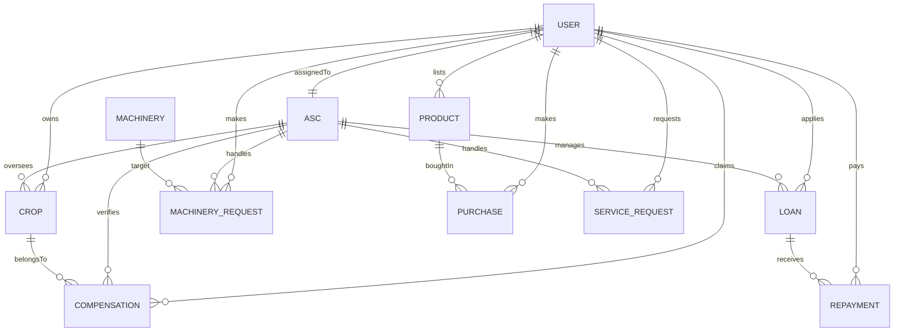

# Database Schema Design - Group 11

Below is the Entity-Relationship (ER) representation of the Agricultural Management System’s MongoDB database schema. You can view this diagram using any markdown editor that supports **Mermaid**, or by pasting the code block below into [Mermaid Live Editor](https://mermaid.live).

## Collections & Key Fields

1. **User**
   - Stores all user accounts (Farmers, Officers, Admins).
   - *Key fields*: `name`, `email`, `nic`, `password`, `role`, `assignedAsc`.

2. **ASC** (Agrarian Service Center)
   - Stores the regional centers that farmers are assigned to.
   - *Key fields*: `name`, `district`, `location`.

3. **Crop**
   - Details of the crops cultivated by farmers.
   - *Key fields*: `farmer` (Ref: User), `name`, `type`, `area`, `status`, `asc` (Ref: ASC).

4. **Compensation**
   - Stores crop failure claims made by farmers.
   - *Key fields*: `farmer` (Ref: User), `crop` (Ref: Crop), `reason`, `amountExpected`, `status`, `asc` (Ref: ASC).

5. **Machinery & FarmerMachinery**
   - Stores community/center machineries and machineries rented out by farmers.
   - *Key fields*: `name`, `type`, `rentCost`, `farmer` (Ref: User) / `asc` (Ref: ASC).

6. **MachineryRequest & ServiceRequest**
   - Stores requests for machinery rental and machinery servicing.
   - *Key fields*: `farmer` (Ref: User), `machinery` (Ref: Machinery), `date`, `status`, `asc` (Ref: ASC).

7. **Loan**
   - Details about agriculture loans acquired by farmers.
   - *Key fields*: `farmer` (Ref: User), `amount`, `interestRate`, `status`, `asc` (Ref: ASC).

8. **Repayment**
   - Monthly or customized repayments against a specific loan.
   - *Key fields*: `loan` (Ref: Loan), `farmer` (Ref: User), `amount`, `bankSlip`.

9. **Product & Purchase**
   - Details of the marketplace. Products listed by farmers and purchased by managers.
   - *Key fields*: `name`, `category`, `quantity`, `seller` (Ref: User), `product` (Ref: Product), `manager` (Ref: User).
